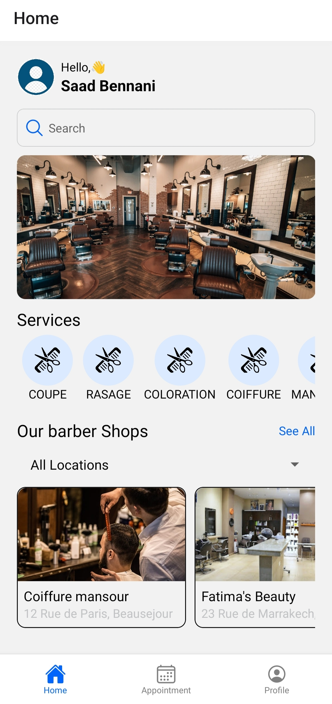
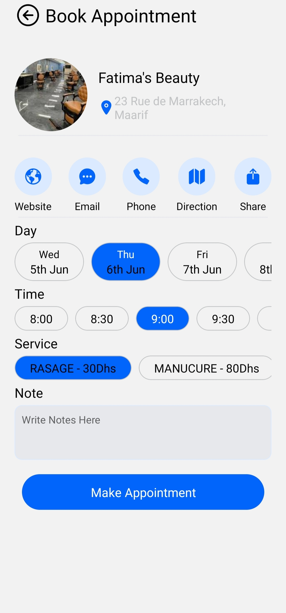
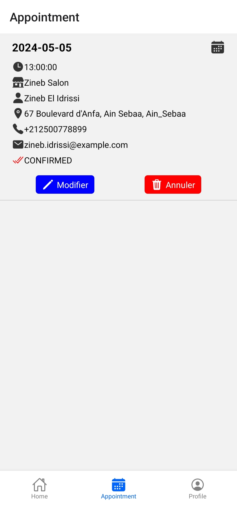
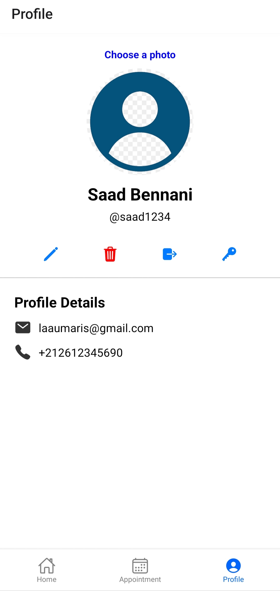
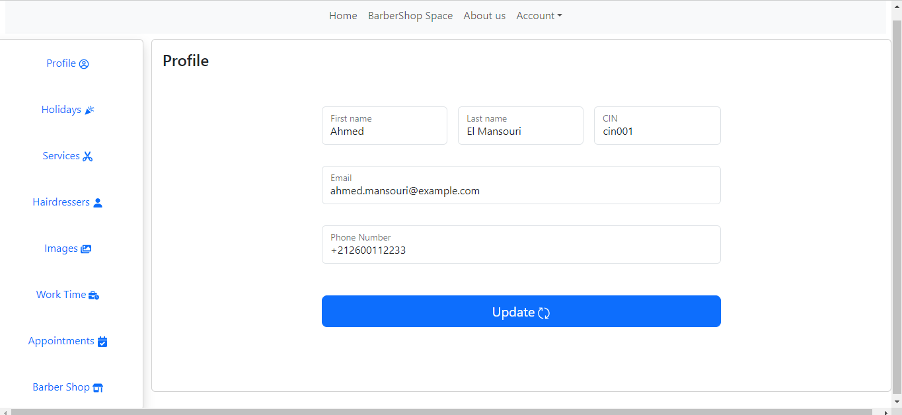

# BarberTime

BarberTime is an application that facilitates booking hairdressing services. It offers a mobile application for customers and a web interface for barbershop owners.

## For Customers (Mobile Application)

### Login
<p align="center">
    
</p>
Login page for customers. Customers can log in to their existing account or create a new one.

### Home
<p align="center">
    
</p>
Home page where customers can see the nearest and most popular barbershops.

### See A Barber Shop
<p align="center">
    
</p>
Barbershop details page. Customers can view detailed information about the shop, including the services offered.

### Search By Service
<p align="center">
    
</p>
Search page where customers can search for barbershops by service.

### Book Appointment
<p align="center">
    
</p>
Booking page where customers can book an appointment with a barber at a barbershop.

### Appointments
<p align="center">
    
</p>
Appointments page where customers can view their past and upcoming appointments.

### Account
<p align="center">
    
</p>
Account page where customers can manage their account information, including changing their password and updating profile information.

## For Owners (Web Application)

### Owner Dashboard
<p align="center">
    
</p>
Owner dashboard where owners can manage their barbershops, including adding new services, managing barbers, and viewing bookings.


## Steps to Run the Project

### 1. Set Up the Database

Use the following Docker commands to set up and run the MySQL database:

```sh
docker run --name some-mysql -e MYSQL_ROOT_PASSWORD=my-secret-pw -e MYSQL_DATABASE=barber_time -e MYSQL_USER=test -e MYSQL_PASSWORD=test -p 3306:3306 -d mysql:latest
docker run --name myadmin -d --link some-mysql:db -p 8080:80 phpmyadmin/phpmyadmin
```

### 2. Configure SMTP Email

You need to have an email and key for SMTP usage in the .properties file:

spring.mail.username=your-email <br/>
spring.mail.password=your-key

### 3. Set Absolute Path for Image Storage

In the file src/main/java/com/barbertime/barbertime_backend/services/ImagesServiceImpl.java, set the absolute path to your resources/static/images/ directory in the uploadImageToStorage function:

String storagePath = "absolute_path_to_the_project/BarberTime/BarberTime_Backend/src/main/resources/static/images/";

### 4. Initialize Database with Data

Activate the CommandLineRunner bean the first time to populate the database with data in src/main/java/com/barbertime/barbertime_backend/BarberTimeBackendApplication.java.

### 5. Run the Backend

Start the backend service.

### 6. Run the Web Frontend

Navigate to the web frontend directory and run:
```sh
npm install
npm start
```
### 7. Configure and Run the Mobile Application

Specify the IP address of your computer in the mobile/App/Config/apiConfig.js file:

export const API_BASE_URL = 'http://your_IP_address:5000';

Then, navigate to the mobile application directory and run:
```sh
npm install
npm start
```
Use the Expo app to view the mobile application.


This section outlines the steps to set up and run the BarberTime project, ensuring clarity and ease of understanding for any developer or user.

