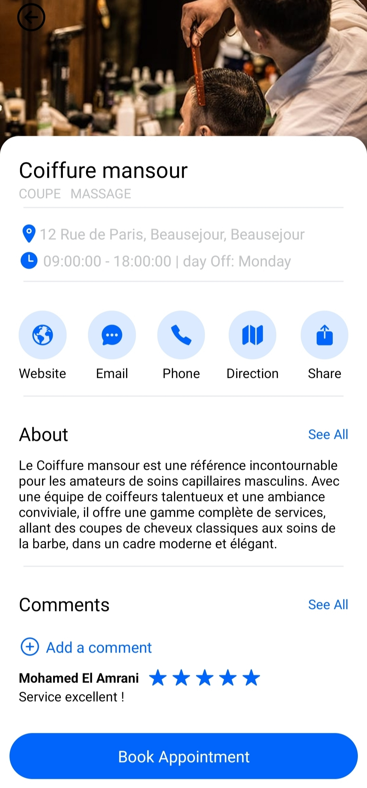

<h1>BarberTime</h1>

BarberTime is an application that facilitates booking hairdressing services. It offers a mobile application for customers and a web interface for barbershop owners.

<h2>For Customers (Mobile Application)</h2>

<h3>Login</h3>

    </img>

Login page for customers. Customers can log in to their existing account or create a new one.

<h3>Home</h3>

    </img>

Home page where customers can see the nearest and most popular barbershops.

<h3>See A Barber Shop</h3>

    </img>

Barbershop details page. Customers can view detailed information about the shop, including the services offered.

<h3>Search By Service</h3>

    </img>

Search page where customers can search for barbershops by service.

<h3>Book Appointment</h3>

    </img>

Booking page where customers can book an appointment with a barber at a barbershop.

<h3>Appointments</h3>

    </img>

Appointments page where customers can view their past and upcoming appointments.

<h3>Account</h3>

    </img>

Account page where customers can manage their account information, including changing their password and updating profile information.

<h2>For Owners (Web Application)</h2>

<h3>Owner Dashboard</h3>

    </img>

Owner dashboard where owners can manage their barbershops, including adding new services, managing barbers, and viewing bookings.

