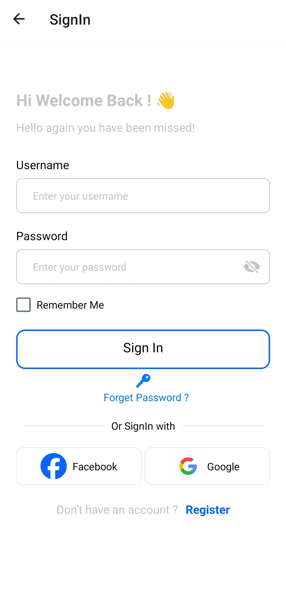

<h1>BarberTime</h1>

BarberTime est une application qui facilite la réservation de services de coiffure. Elle offre une interface utilisateur pour les clients et une interface web pour les propriétaires de salons de coiffure.

<h2>Pour les clients (Application mobile)</h2>

<h3>Login</h3>
</img>

Page de connexion pour les clients. Les clients peuvent se connecter à leur compte existant ou créer un nouveau compte.

<h3>Home</h3>
</img>

Page d'accueil où les clients peuvent voir les salons de coiffure les plus proches et les plus populaires.

<h3>See A Barber Shop</h3>
</img>

Page de détails d'un salon de coiffure. Les clients peuvent voir les informations détaillées du salon, y compris les services offerts et les coiffeurs disponibles.

<h3>Search By Service</h3>
</img>

Page de recherche où les clients peuvent rechercher des salons de coiffure par service.

<h3>Book Appointment</h3>
</img>

Page de réservation où les clients peuvent réserver un rendez-vous avec un coiffeur dans un salon de coiffure.

<h3>Appointments</h3>
</img>

Page des rendez-vous où les clients peuvent voir leurs rendez-vous passés et à venir.

<h3>Account</h3>
</img>

Page de compte où les clients peuvent gérer leurs informations de compte, y compris le changement de mot de passe et la mise à jour des informations de profil.

<h2>Pour les propriétaires (Application web)</h2>

<h3>Owner Dashboard</h3>
</img>

Tableau de bord du propriétaire où les propriétaires peuvent gérer leurs salons de coiffure, y compris l'ajout de nouveaux services, la gestion des coiffeurs et la visualisation des réservations.

